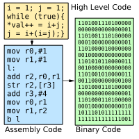

====================
Baking Pi OS
====================

:Author: Alex Chadwick <awc32@cam.ac.uk>
:Translator: SivaCoHan <sivacohan@gmail.com>
:Date: 2014-03-13

.. contents:: 目录
.. sectnum::

简介
----

没学过操作系统，看到了就试试翻译一下。也当学习操作系统了。
如果有翻译错误，或者什么问题，欢迎联系。

原文地址: http://www.cl.cam.ac.uk/projects/raspberrypi/tutorials/os/

Baking Pi - Operating Systems Development
-------------------------------------------

欢迎来到Baking Pi: 操作系统开发, 课程由 Alex Chadwick 开发。当前版本是 1.0c (2013年7月).

这个教程会帮助你一步一步的开发一个运行在Raspberry Pi平台上的操作系统! 这个教程的目标群体是16岁以上的人, 当然更年轻的读者也可以从中获益, 尤其是在有人帮助的情况下. 这个教程里面会及时的增加更多课程的.

这个教程会使用汇编来进行基本的操作系统开发. 我尝试假设读者没有任何关于操作系统开发和汇编的知识. 有编程经验的读者有可能会更轻松的理解这个教程, 当然没有经验也是可以的. Raspberry Pi 论坛有很多乐于助人的朋友，当年陷入困境的时候，他们会给予你帮助的. 这个教材被分解为多个课程, 你应该按照顺序来学习. 每一节课程都会提到一些理论, 一些最佳实践, #TODO complete with a full answer.

这个教程的目标是带领读者完成操作系统共有的基本组件而不是完成一个完整的面面俱到的操作系统. 幸运的是, 当你学习完本教程, 你将会有足够的知识来创建一个自己的操作系统. 虽然这个教程针对的平台是Raspberry Pi, 但是这个平台也提供了足够大的空间供您玩耍. 或许, 当你阅读关于函数部分的教程, 你会提出一个更好的代码风格. 或许, 你阅读关于图片处理的课程后, 你会提出3D操作系统(这是啥... 3D Operating System). 虽然这只是操作系统的课程, 但是你将会有能力创造你喜欢的东西. 如果你有想法, 尽管尝试吧. 计算机科学仍然是一个年轻的学科, 并且有着广阔的空间等待你去开发. 

需要的准备工作
~~~~~~~~~~~~~~

为了完成这个课程, 你需要做一些准备工作. 首先你需要有Raspberry Pi, SD卡, Raspberry Pi的供电设备. 当然, 你也需要一台电脑, 运行的操作系统可以是 Linux, Windows, Mac OSX, 对操作系统的需求是, 可以向SD卡写入, 可以装软件. 给Raspberry Pi 配一块屏幕对课程会有帮助, 但这不是必须的. 

至于软件, 你需要GNU编译链, 目标平台是ARMv6. 下载链接在Download Page上, 课程练习的答案也在那里.

课程简介
~~~~~~~~~~~~~~

Table 2.1 - Lessons

+--+-------------------------+---------------------------------------------------------------------------------------------------------------+
|  |名称                     |简介                                                                                                           |
+--+-------------------------+---------------------------------------------------------------------------------------------------------------+
| 0|课程介绍                 |这个课程没有什么实际的内容, 主要是介绍什么是操作系统, 什么是汇编等. 如果你有一定经验, 可以直接掠过这一节.      |
+--+-------------------------+---------------------------------------------------------------------------------------------------------------+
| OK LED 系列                                                                                                                                |
+--+-------------------------+---------------------------------------------------------------------------------------------------------------+
| 1|OK01                     | OK01 这一节讲述如何开始(猜测应该是准备工具吧), 以及如何电量OK ACT 两个LED(这两个LED 在USB附近)                |
+--+-------------------------+---------------------------------------------------------------------------------------------------------------+
| 2|OK02                     | 在OK01的基础上, 让OK LED 闪烁起来                                                                             |
+--+-------------------------+---------------------------------------------------------------------------------------------------------------+
| 3|OK03                     | 在OK02的基础上, 学习如何在汇编中使用函数, 以提高代码复用能力                                                  |
+--+-------------------------+---------------------------------------------------------------------------------------------------------------+
| 4|OK04                     | 在OK03的基础上, 学习如何使用timer, 让OK LED 按照设定的精确时间闪烁                                            |
+--+-------------------------+---------------------------------------------------------------------------------------------------------------+
| 5|OK05                     | 在OK04的基础上, 让OK LED按照SOS的莫斯码闪烁 (...---...)                                                       |
+--+-------------------------+---------------------------------------------------------------------------------------------------------------+
| 屏幕系列                                                                                                                                   |
+--+-------------------------+---------------------------------------------------------------------------------------------------------------+
| 6|Screen01                 | Screen01这节会介绍图片相关的理论, 然后尝试在屏幕或电视上显示一个梯度图形(#TODO 似乎不对)                      |
+--+-------------------------+---------------------------------------------------------------------------------------------------------------+
| 7|Screen02                 | 在Screen01的基础上, 学习如何在屏幕上花直线, 以及生成伪随机数的小特性                                          |
+--+-------------------------+---------------------------------------------------------------------------------------------------------------+
| 8|Screen03                 | 在Screen02的基础上, 学习如何在屏幕上显示文字, 并介绍kernel command line                                       |
+--+-------------------------+---------------------------------------------------------------------------------------------------------------+
| 9|Screen04                 | 在Screen03的基础上, 学习如何控制屏幕上的文字                                                                  |
+--+-------------------------+---------------------------------------------------------------------------------------------------------------+
| 输入系列                                                                                                                                   |
+--+-------------------------+---------------------------------------------------------------------------------------------------------------+
|10|Input01                  | 在Input01这一节, 学习驱动理论, 链接程序, 例如键盘等设备. 我们将会读取键盘输入, 输出到屏幕上                   |
+--+-------------------------+---------------------------------------------------------------------------------------------------------------+
|11|Input02                  | 在Input01的基础上, 学习如何开发一个命令行接口                                                                 |
+--+-------------------------+---------------------------------------------------------------------------------------------------------------+

lession 0 课程介绍
--------------------

这节课程没有特别的内容, 主要是介绍什么是操作系统, 什么是汇编等. 如果你有一定经验, 或者你急于开始课程, 可以直接略过这一节.

操作系统
~~~~~~~~~~

操作系统可以看作一个非常复杂的程序. 他的主要工作是管理这台电脑上的其他程序, 包括分享这台电脑的时间, 内存, 硬件和其他资源. 你可能听说过一些桌面操作系统如, GNU/Linux, Mac OSX, Microsoft Windows. 除了电脑, 如手机等其他设备也需要操作系统, 他们可能会使用 Android, IOS 或者 Windows Phone.

因为操作系统必须运行在硬件设备上, 所以我们必须学一些关于硬件设备的知识. 为了使操作系统可以在更多的电脑上运行, 驱动程序被开发了出来. 驱动程序是很小的程序，被设计成可以添加或删除的程序, 其设计的目的就是让操作系统可以和特定的硬件通话, 使操作系统可以正确识别并使用硬件. 在这个课程里, 我们不学习驱动程序的开发, 取而代之的是, 我们将会针对Raspberry Pi 开发一个驱动.

操作系统设计有非常多的风格和不同, 这个课程只能涉及皮毛. 这个课程我们将会关注操作系统和硬件通过bit的通信, 并且这里将会是经常出现trick的地方, 并且这里是文档和online help最少的地方. 

汇编
~~~~~~~~~~

这个教程基本都是用汇编写的. 汇编是非常贴近机器语言的一种编程语言. 计算机的工作原理是: 有一个叫处理器(processor) 的东西, 来处理例如加法的等任务. 有一个叫RAM的东西来作为存储. 计算机开启之后, 会按照开发人员的设计来执行一系列指令, 这些指令会导致RAM中存储的数据改变, 进而影响到硬件设备. 汇编是把这些指令转换成更适合人阅读的文本. (这段就是在说汇编语言是什么...)

通常编程的时候, 程序员会使用诸如 C++, Java, C#, Basic 等编程语言, 然后用一个称之为"编译器"的程序将他们转换为汇编代码, 之后会转换为二进制代码. 二进制代码是计算机实际所使用的, 但是二进制代码几乎无法直接被人类阅读. 汇编能稍微好一点, 但是你可能会因为汇编能使用的命令太少而失望. 记住, 任何你写的汇编代码都是能直接被计算机理解的, 所以这些命令被设计的非常简单, 目的是每个时钟周期能必须处理一条. 

和普通的编程意义, 汇编也有很多语言, 和正常的编程语言的区别是, 造成汇编语言之间的区别的直接原因是处理器的不同, 每一种处理器的设计都对应不同的汇编语言. 因此, 为某一种机器写的汇编代码是不会成功运行在另外一种机器上的. 对于大多数情况来说, 为每个操作系统重写一次程序就是一个灾难(说程序的可移植性问题), 幸好这对操作系统来说不是什么太大的问题, 操作系统为了适应新硬件必须做出适当的调整或重写. 当然, 大多数操作系统是用 C/C++ 写成的, 他们可以具有良好的可移植性, 除了少部分必须由汇编写成的部分.

好, 我们可以开始课程的第一节了.

lesson 1 OK01
--------------------

OK01 这一节讲述如何开始, 以及如何电量OK ACT 两个LED(这两个LED 在USB附近)

准备开始
~~~~~~~~~~

我假定你已经从Download下载了GNU toolchain. 在Download页面还有一个叫 OS Template的文件. 请下载这个文件并解压.

开始
~~~~~~~~~~

现在你已经解压好了template, 在'source'目录下建立一个新的文件'main.s'. 这个操作系统的代码会写在这个文件里面. 具体的, 这个目录结构看起来应该是这样的:

